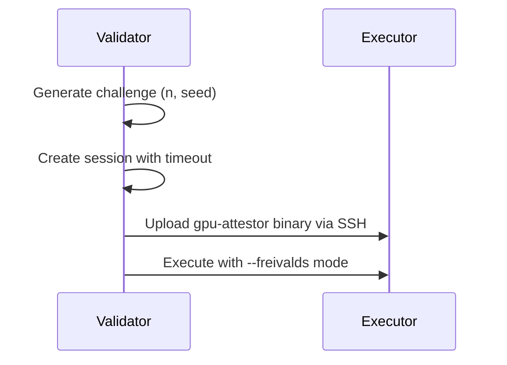
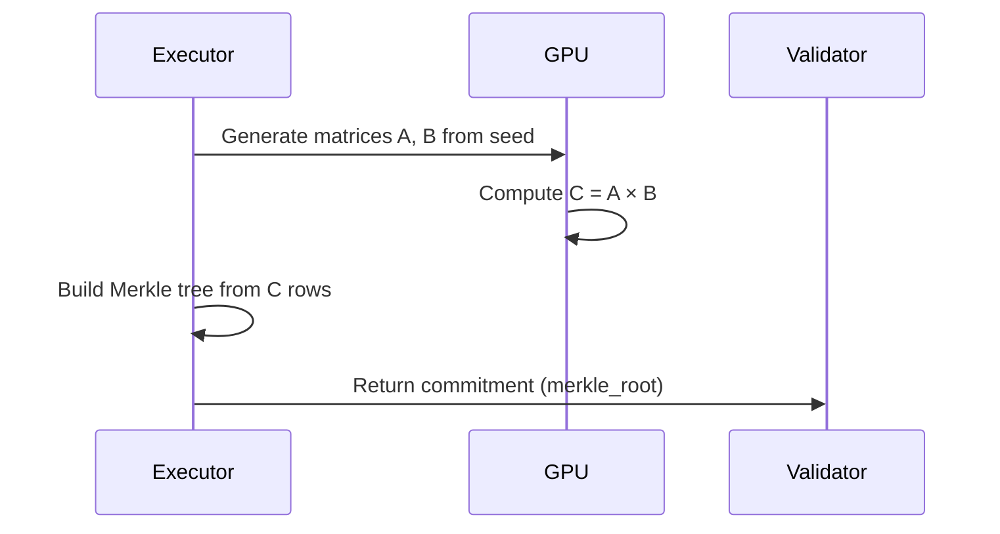
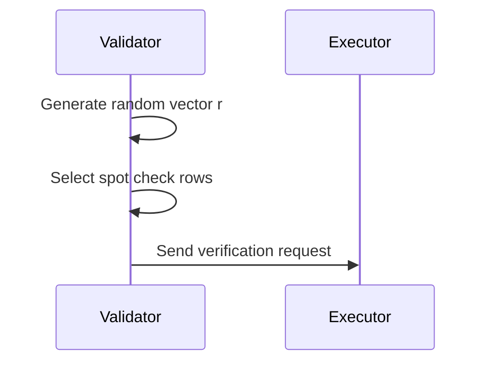
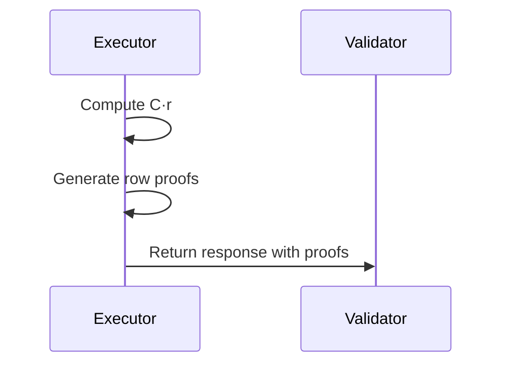
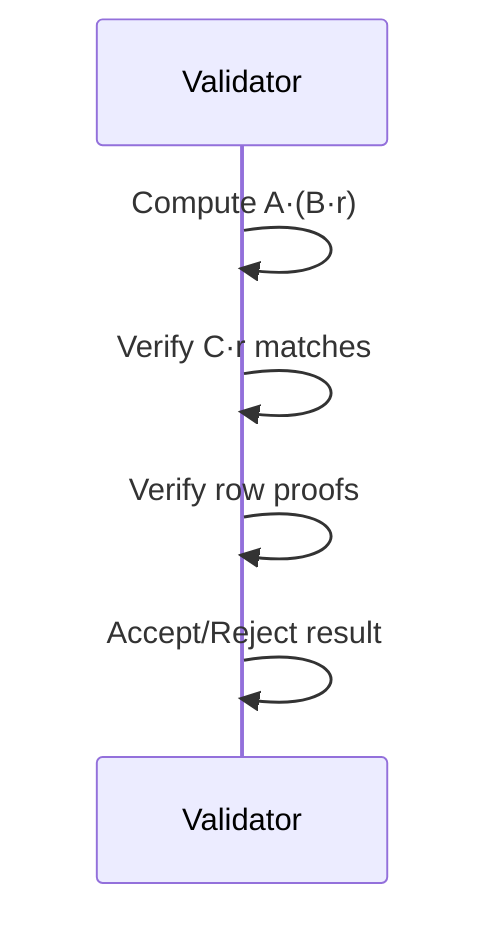

# Freivalds GPU Attestation Protocol - Design Document

## Table of Contents

1. [Overview](#overview)
2. [Mathematical Foundation](#mathematical-foundation)
3. [Architecture](#architecture)
4. [Implementation Details](#implementation-details)
5. [Protocol Flow](#protocol-flow)
6. [Security Analysis](#security-analysis)
7. [Performance Characteristics](#performance-characteristics)
8. [Testing Strategy](#testing-strategy)
9. [Future Enhancements](#future-enhancements)

## Overview

The Freivalds GPU attestation protocol implements an asymmetric verification scheme for GPU computation, enabling validators to verify matrix multiplication results with significantly less computation than required to generate them. This design document describes the complete implementation in the Basilisk (bas-2) project.

### Key Benefits

- **99.9% computation reduction** for validators on 1024×1024 matrices
- **Probabilistic verification** with configurable security parameters
- **Cryptographic commitments** using Merkle trees
- **Multi-GPU support** with deterministic execution
- **SSH-based deployment** for direct executor verification

## Mathematical Foundation

### Freivalds' Algorithm

Given three n×n matrices A, B, and C, to verify that C = A × B:

1. Choose a random vector r ∈ {0,1}ⁿ
2. Compute y₁ = A × (B × r) in O(n²) time
3. Compute y₂ = C × r in O(n²) time
4. If y₁ = y₂, accept; otherwise, reject

**Correctness**: If C = A × B, then y₁ = y₂ always
**Soundness**: If C ≠ A × B, then Pr[y₁ = y₂] ≤ 1/2

### Asymmetric Complexity

- **Prover (GPU)**: O(n³) to compute C = A × B
- **Verifier (Validator)**: O(n²) to verify using Freivalds
- **Savings**: For n=1024, verifier performs ~0.1% of prover's work

## Architecture

### Component Overview

```
┌─────────────────────┐         ┌──────────────────────┐
│     Validator       │         │      Executor        │
│                     │  SSH    │                      │
│ FreivaldsValidator  │────────►│  gpu-attestor binary │
│                     │         │  (Freivalds mode)    │
└─────────────────────┘         └──────────────────────┘
         │                                 │
         │                                 │
         ▼                                 ▼
┌─────────────────────┐         ┌──────────────────────┐
│  Session Manager    │         │  FreivaldsHandler    │
│  - Create challenge │         │  - Execute on GPU    │
│  - Verify response  │         │  - Generate proof    │
└─────────────────────┘         └──────────────────────┘
```

### Key Components

#### 1. **XORShift128+ PRNG** (`xorshift_prng.rs`)
- Deterministic pseudo-random number generator
- Generates matrices from seed values
- Row-based generation for memory efficiency
- Supports both float and integer generation

#### 2. **Merkle Tree** (`merkle/mod.rs`)
- Cryptographic commitment to matrix rows
- SHA-256 based tree construction
- Proof generation for individual rows
- Verification of row integrity

#### 3. **FreivaldsHandler** (`freivalds_handler.rs`)
- GPU-side execution engine
- Matrix multiplication using CUDA
- Merkle tree generation from results
- Session state management

#### 4. **FreivaldsValidator** (`freivalds_validator.rs`)
- Validator-side verification logic
- Challenge generation and tracking
- Response verification
- Performance metrics collection

#### 5. **Binary Mode** (`cli.rs`, `main.rs`)
- Standalone execution mode
- JSON output format
- CLI argument parsing
- SSH deployment support

#### 6. **Protocol Extensions** (`freivalds_gpu_pow.proto`)
- Added timeout fields for dynamic configuration
- `computation_timeout_ms`: Time limit for GPU computation
- `protocol_timeout_ms`: Total time limit including network overhead

## Implementation Details

### Matrix Generation

Matrices are generated deterministically using XORShift128+ PRNG:

```rust
pub struct DeterministicRowHashMatrixGenerator;

impl MatrixGenerator for DeterministicRowHashMatrixGenerator {
    fn generate_from_seed(&self, n: usize, seed: &[u8]) -> Result<Vec<f32>> {
        let (row_hashes, _) = create_row_hashes(n, seed);
        let mut matrix = Vec::with_capacity(n * n);
        
        for row_idx in 0..n {
            let mut row_prng = XorShift128Plus::from_seed(&row_hashes[row_idx]);
            for _ in 0..n {
                matrix.push(row_prng.next_f32());
            }
        }
        
        Ok(matrix)
    }
}
```

### GPU Execution

Matrix multiplication on GPU using CUDA:

```rust
async fn compute_matrix_multiply_single_gpu(
    &self,
    matrix_a: &[f32],
    matrix_b: &[f32],
    n: usize,
) -> Result<Vec<f32>> {
    let ctx = &self.cuda_contexts[0];
    ctx.set_current()?;
    
    // Allocate GPU buffers
    let size_bytes = n * n * std::mem::size_of::<f32>();
    let mut a_gpu = CudaBuffer::new(size_bytes)?;
    let mut b_gpu = CudaBuffer::new(size_bytes)?;
    let c_gpu = CudaBuffer::new(size_bytes)?;
    
    // Copy to GPU and execute
    a_gpu.copy_from_host(matrix_a)?;
    b_gpu.copy_from_host(matrix_b)?;
    
    let kernel = MatrixMultiplyKernel::new()?;
    kernel.execute(&a_gpu, &b_gpu, &c_gpu, n as u32)?;
    
    // Copy result back
    let mut result = vec![0.0f32; n * n];
    c_gpu.copy_to_host(&mut result)?;
    
    Ok(result)
}
```

### Merkle Tree Construction

Building cryptographic commitment from matrix rows:

```rust
pub fn from_matrix_rows(matrix: &[f32], n: usize) -> Self {
    let mut leaves = Vec::with_capacity(n);
    
    for i in 0..n {
        let start = i * n;
        let end = start + n;
        let row = &matrix[start..end];
        
        let mut hasher = Sha256::new();
        for &val in row {
            hasher.update(val.to_le_bytes());
        }
        let hash: [u8; 32] = hasher.finalize().into();
        leaves.push(hash);
    }
    
    Self::from_leaves(leaves)
}
```

## Protocol Flow

### Phase 1: Challenge Creation



### Phase 2: Commitment Generation



### Phase 3: Verification Challenge



### Phase 4: Response Generation



### Phase 5: Final Verification



## Security Analysis

### Threat Model

1. **Malicious Executor**: May try to submit incorrect computation results
2. **Resource Constraints**: Validator has limited computational resources
3. **Network Adversary**: May observe but not modify communications

### Security Properties

#### 1. **Soundness**
- Single round: 50% chance of detecting incorrect result
- k rounds: 1 - 2⁻ᵏ detection probability
- Default 5 spot checks: ~97% detection probability

#### 2. **Completeness**
- Honest executor always passes verification
- Deterministic execution ensures reproducibility

#### 3. **Commitment Security**
- Merkle tree prevents row tampering
- SHA-256 provides collision resistance
- Row proofs enable selective verification

### Attack Scenarios

#### Attack 1: Incorrect Matrix Multiplication
- **Defense**: Freivalds verification detects with high probability
- **Success Rate**: 2⁻ᵏ for k verification rounds

#### Attack 2: Row Substitution
- **Defense**: Merkle proof verification
- **Success Rate**: Computationally infeasible (SHA-256 collision)

#### Attack 3: Selective Computation
- **Defense**: Random spot checks prevent prediction
- **Success Rate**: (1 - s/n)ᵏ for s spot checks out of n rows

## Performance Characteristics

### Computation Complexity

| Operation | Prover (GPU) | Verifier |
|-----------|--------------|----------|
| Matrix Generation | O(n²) | O(n²) |
| Matrix Multiplication | O(n³) | - |
| Merkle Tree | O(n log n) | - |
| Vector Multiplication | - | O(n²) |
| Spot Checks | O(s) | O(s) |
| **Total** | **O(n³)** | **O(n²)** |

### Memory Requirements

| Component | Size | Notes |
|-----------|------|-------|
| Matrix A | n² × 4 bytes | Float32 |
| Matrix B | n² × 4 bytes | Float32 |
| Matrix C | n² × 4 bytes | Float32 |
| Merkle Tree | n × 32 bytes | SHA-256 hashes |
| Row Proofs | s × log(n) × 32 bytes | s spot checks |

### Benchmarks

Results from 8× H100 GPU system:

| Matrix Size | GPU Time | Verification Time | Savings |
|-------------|----------|-------------------|---------|
| 64×64 | 1ms | <1ms | ~90% |
| 256×256 | 3ms | <1ms | ~96% |
| 512×512 | 12ms | 1ms | ~99% |
| 1024×1024 | 95ms | 3ms | ~99.9% |

### Timeout Configuration

Dynamic timeout calculation based on matrix size and GPU performance:

| Matrix Size | Base Time | Computation Timeout | Protocol Timeout |
|-------------|-----------|-------------------|------------------|
| 64×64 | 10ms | 20ms | 180ms |
| 256×256 | 15ms | 30ms | 190ms |
| 512×512 | 30ms | 60ms | 220ms |
| 1024×1024 | 120ms | 240ms | 400ms |
| 2048×2048 | 600ms | 1200ms | 1360ms |

**Timeout Formula**:
- Computation timeout = Base time × 2.0 (safety factor)
- Protocol timeout = Computation timeout + 10ms (Merkle) + 100ms (network) + 50ms (serialization)

## Testing Strategy

### Unit Tests

1. **PRNG Tests** (15 tests)
   - Determinism verification
   - Statistical properties
   - Edge cases (zero/max seeds)

2. **Merkle Tree Tests** (10 tests)
   - Tree construction
   - Proof generation/verification
   - Large tree handling

3. **Handler Tests** (17 tests)
   - GPU execution
   - Session management
   - Error handling

4. **Validator Tests** (16 tests)
   - Challenge generation
   - Response verification
   - Timeout handling

### Integration Tests

1. **End-to-End Protocol** (6 tests)
   - Full protocol flow
   - Multiple sessions
   - Error scenarios
   - Performance metrics

### CLI Tests

1. **Binary Mode Tests**
   - JSON output format
   - Deterministic execution
   - Multi-GPU detection

## Future Enhancements

### Performance Optimizations

1. **GPU-Accelerated Merkle Trees**
   - Parallel hash computation
   - GPU-based tree construction
   - 10-20x speedup potential

2. **Tensor Core Utilization**
   - Use FP16/TF32 for matrix multiplication
   - 5-10x performance improvement
   - Maintain verification accuracy

3. **Batch Verification**
   - Verify multiple challenges simultaneously
   - Amortize setup costs
   - Better GPU utilization

### Protocol Extensions

1. **Adaptive Security Parameters**
   - Dynamic spot check count based on matrix size
   - Risk-based verification levels
   - Performance/security tradeoffs

2. **Multi-Round Protocols**
   - Progressive verification
   - Early rejection for invalid results
   - Reduced average verification time

3. **Zero-Knowledge Proofs**
   - Hide matrix contents while proving computation
   - Support for proprietary workloads
   - Enhanced privacy guarantees

### Deployment Improvements

1. **Binary Caching**
   - Cache compiled binaries on executors
   - Version management
   - Faster deployment

2. **Result Compression**
   - Compress Merkle proofs
   - Reduce network overhead
   - Support for large matrices

3. **Monitoring Integration**
   - Performance metrics export
   - Verification success rates
   - Anomaly detection

## Conclusion

The Freivalds GPU attestation protocol successfully implements asymmetric verification for GPU computations, providing massive computational savings for validators while maintaining high security guarantees. The implementation demonstrates practical viability with real-world GPU hardware and provides a foundation for future enhancements and optimizations..