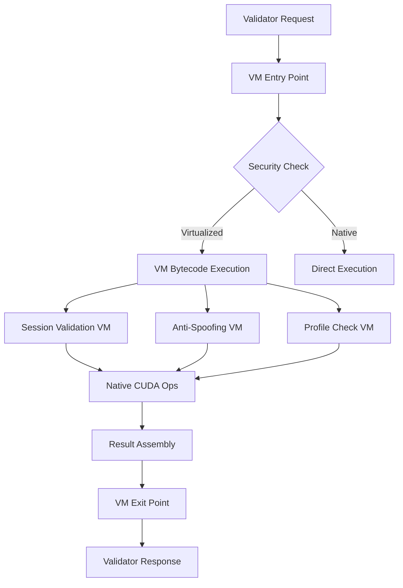

# Freivalds GPU Attestation Virtualization Design Document

## Executive Summary

This document presents a comprehensive design for virtualizing security-critical components of the Freivalds GPU attestation protocol while maintaining optimal performance for compute-intensive operations. The virtualization strategy protects intellectual property, prevents tampering, and makes reverse engineering "tremendously annoying" for potential attackers.

## Table of Contents

1. [Strategic Overview](#strategic-overview)
2. [Architecture Design](#architecture-design)
3. [Virtual Machine Implementation](#virtual-machine-implementation)
4. [Security-Critical Components](#security-critical-components)
5. [Performance Optimization](#performance-optimization)
6. [Implementation Phases](#implementation-phases)
7. [Security Analysis](#security-analysis)

## Strategic Overview

### Core Principles

1. **Selective Virtualization**: Only virtualize security-critical logic while keeping performance-critical operations native
2. **Layered Defense**: Multiple virtualization layers for ultra-critical paths
3. **Dynamic Protection**: Runtime-generated bytecode and adaptive security measures
4. **Performance Preservation**: Maintain <5% overhead for GPU operations

### What to Virtualize vs. Keep Native

#### Keep Native (Performance-Critical)
- CUDA kernel execution (`matrix_multiply_monitored.cu`)
- GPU memory operations (CudaBuffer allocations)
- Core Freivalds math (matrix-vector multiplication)
- Merkle tree hashing operations
- XORShift PRNG number generation

#### Virtualize (Security-Critical)
- Session state management and validation
- Spot check selection algorithm
- GPU profile validation logic
- Anti-spoofing detection algorithms
- Timeout calculation and enforcement
- Challenge vector generation logic
- Verification result interpretation

## Architecture Design

### Hybrid Virtualization Architecture

```
┌────────────────────────────────────────────────────────┐
│                  GPU Attestor Binary                    │
├────────────────────────────────────────────────────────┤
│              Virtualization Layer (VM)                  │
│  ┌──────────────────────────────────────────────────┐  │
│  │          Protected Security Components           │  │
│  ├──────────────────────────────────────────────────┤  │
│  │ • Session State Machine (encrypted bytecode)     │  │
│  │ • Anti-Spoofing Logic (obfuscated algorithms)   │  │
│  │ • GPU Profile Validation (dynamic checks)       │  │
│  │ • Spot Check Selection (randomized bytecode)    │  │
│  │ • Timeout Enforcement (tamper-resistant)        │  │
│  └──────────────────────────────────────────────────┘  │
├────────────────────────────────────────────────────────┤
│               Native Execution Layer                    │
│  ┌──────────────────────────────────────────────────┐  │
│  │         High-Performance Components              │  │
│  ├──────────────────────────────────────────────────┤  │
│  │ • CUDA Kernel Execution                          │  │
│  │ • Matrix Multiplication (A × B = C)              │  │
│  │ • Merkle Tree Construction                       │  │
│  │ • GPU Memory Management                          │  │
│  │ • Network I/O Operations                         │  │
│  └──────────────────────────────────────────────────┘  │
└────────────────────────────────────────────────────────┘
```

### Component Interaction Flow



## Virtual Machine Implementation

### Custom VM Architecture

```rust
// VM instruction set for Freivalds protocol
#[repr(u8)]
pub enum VMInstruction {
    // Stack operations
    VM_PUSH = 0x01,
    VM_POP = 0x02,
    VM_DUP = 0x03,
    VM_SWAP = 0x04,
    
    // Session management
    VM_INIT_SESSION = 0x10,
    VM_VALIDATE_SESSION = 0x11,
    VM_CHECK_TIMEOUT = 0x12,
    VM_CLEANUP_SESSION = 0x13,
    
    // Security validation
    VM_VERIFY_GPU_UUID = 0x20,
    VM_CHECK_EXECUTION_PATTERN = 0x21,
    VM_VALIDATE_TIMING = 0x22,
    VM_CHECK_MEMORY_PRESSURE = 0x23,
    
    // Spot check logic
    VM_GENERATE_SPOT_INDICES = 0x30,
    VM_VALIDATE_MERKLE_PROOF = 0x31,
    VM_VERIFY_ROW_INTEGRITY = 0x32,
    
    // Control flow
    VM_JUMP = 0x40,
    VM_JUMP_IF_TRUE = 0x41,
    VM_JUMP_IF_FALSE = 0x42,
    VM_CALL = 0x43,
    VM_RETURN = 0x44,
    
    // Cryptographic operations
    VM_HASH = 0x50,
    VM_VERIFY_SIGNATURE = 0x51,
    VM_GENERATE_RANDOM = 0x52,
    
    // Anti-analysis
    VM_OBFUSCATE = 0x60,
    VM_CHECK_DEBUGGER = 0x61,
    VM_TIMING_CHECK = 0x62,
}

pub struct FreivaldsVM {
    // Encrypted bytecode storage
    bytecode: Vec<u8>,
    bytecode_key: [u8; 32],
    
    // VM execution state
    stack: Vec<VMValue>,
    memory: HashMap<u32, VMValue>,
    registers: [u64; 16],
    program_counter: usize,
    
    // Security context
    session_keys: HashMap<String, [u8; 32]>,
    validation_state: ValidationState,
    
    // Anti-tampering
    execution_fingerprint: Blake3Hasher,
    timing_checks: Vec<(Instant, u64)>,
}

#[derive(Clone)]
pub enum VMValue {
    U32(u32),
    U64(u64),
    F32(f32),
    Bytes(Vec<u8>),
    SessionId(String),
    GpuProfile(GpuProfileData),
}
```

### Bytecode Generation and Encryption

```rust
pub struct BytecodeGenerator {
    /// Generate session-specific bytecode
    pub fn generate_session_bytecode(
        &self,
        session_id: &str,
        base_logic: &[u8],
    ) -> Result<Vec<u8>> {
        // Derive session-specific key
        let session_key = self.derive_session_key(session_id)?;
        
        // Customize bytecode with random padding and reordering
        let mut bytecode = base_logic.to_vec();
        self.inject_anti_patterns(&mut bytecode)?;
        self.randomize_instruction_order(&mut bytecode, &session_key)?;
        
        // Encrypt with AES-GCM
        let encrypted = self.encrypt_bytecode(&bytecode, &session_key)?;
        
        Ok(encrypted)
    }
    
    /// Inject anti-analysis patterns
    fn inject_anti_patterns(&self, bytecode: &mut Vec<u8>) -> Result<()> {
        // Add timing checks
        bytecode.extend(&[VM_TIMING_CHECK as u8]);
        
        // Add debugger detection
        bytecode.extend(&[VM_CHECK_DEBUGGER as u8]);
        
        // Add obfuscation layers
        bytecode.extend(&[VM_OBFUSCATE as u8]);
        
        Ok(())
    }
}
```

## Security-Critical Components

### 1. Session State Validation (Virtualized)

```rust
// Original validation logic (to be compiled to VM bytecode)
fn validate_session_state_vm(session: &ValidationSession) -> VMProgram {
    compile_to_vm! {
        // Load session data
        push session.id;
        push session.created_at;
        push session.timeout;
        
        // Check session age
        call check_session_timeout;
        jump_if_false invalid_session;
        
        // Verify session integrity
        push session.commitment;
        call verify_commitment_integrity;
        jump_if_false invalid_session;
        
        // Check GPU count matches
        push session.expected_gpu_count;
        push session.actual_gpu_count;
        call compare_gpu_counts;
        jump_if_false gpu_mismatch;
        
        // All checks passed
        push true;
        return;
        
        invalid_session:
        push false;
        push "Session validation failed";
        return;
        
        gpu_mismatch:
        push false;
        push "GPU count mismatch";
        return;
    }
}
```

### 2. Anti-Spoofing Logic (Virtualized)

```rust
// Complex anti-spoofing checks hidden in VM
fn anti_spoofing_checks_vm() -> VMProgram {
    compile_to_vm! {
        // GPU UUID uniqueness check
        push gpu_uuids;
        call check_uuid_uniqueness;
        jump_if_false spoofing_detected;
        
        // Execution timing analysis
        push execution_times;
        call analyze_timing_patterns;
        push max_variance_allowed;
        call check_timing_variance;
        jump_if_false timing_anomaly;
        
        // Memory pressure validation
        push memory_usage_pattern;
        call validate_memory_pressure;
        push min_memory_threshold;
        call compare_memory_usage;
        jump_if_false insufficient_memory;
        
        // Cross-GPU communication test
        push gpu_pairs;
        call test_cross_gpu_transfer;
        push min_transfer_rate;
        call validate_transfer_rates;
        jump_if_false transfer_failure;
        
        // Hardware fingerprinting
        push gpu_profiles;
        call generate_hardware_fingerprints;
        call validate_fingerprint_uniqueness;
        jump_if_false fingerprint_mismatch;
        
        // All anti-spoofing checks passed
        push true;
        return;
    }
}
```

### 3. Spot Check Selection (Virtualized)

```rust
// Secure spot check selection with hidden algorithm
fn select_spot_checks_vm(
    seed: &[u8],
    matrix_size: u32,
    count: u32,
) -> VMProgram {
    compile_to_vm! {
        // Initialize secure RNG with seed
        push seed;
        call init_secure_rng;
        
        // Generate indices with complex algorithm
        push count;
        push matrix_size;
        
        loop_start:
        // Generate next index with non-linear transformation
        call generate_random_u64;
        push matrix_size;
        call complex_modulo_operation;
        
        // Apply secret transformation
        call secret_index_transformation;
        
        // Check uniqueness
        call check_index_unique;
        jump_if_false loop_start;
        
        // Store index
        call store_spot_check_index;
        
        // Decrement counter
        push 1;
        sub;
        dup;
        push 0;
        compare;
        jump_if_greater loop_start;
        
        // Return indices
        call get_all_indices;
        return;
    }
}
```

### 4. GPU Profile Validation (Virtualized)

```rust
// GPU profile validation with hidden thresholds
fn validate_gpu_profile_vm(profile: &GpuProfile) -> VMProgram {
    compile_to_vm! {
        // Load profile data
        push profile.model;
        push profile.compute_capability;
        push profile.memory_size;
        push profile.bandwidth;
        
        // Check against secret database
        call load_secret_gpu_database;
        call find_matching_profile;
        jump_if_false unknown_gpu;
        
        // Validate performance characteristics
        push profile.measured_tflops;
        call get_expected_tflops;
        call calculate_deviation;
        push secret_tolerance_threshold;
        call check_within_tolerance;
        jump_if_false performance_mismatch;
        
        // Check for virtualization indicators
        push profile.pci_info;
        call check_pci_virtualization_signs;
        jump_if_true virtualization_detected;
        
        // Thermal pattern analysis
        push profile.thermal_readings;
        call analyze_thermal_patterns;
        call check_thermal_authenticity;
        jump_if_false thermal_anomaly;
        
        // Profile validated
        push true;
        return;
    }
}
```

## Performance Optimization

### 1. JIT Compilation for Hot Paths

```rust
pub struct VMJitCompiler {
    /// Compile frequently executed VM code to native
    pub fn compile_hot_path(&mut self, bytecode: &[u8]) -> Result<NativeCode> {
        // Analyze execution frequency
        if self.execution_count(bytecode) > HOT_PATH_THRESHOLD {
            // Generate optimized native code
            let native = self.generate_native_code(bytecode)?;
            
            // Cache for future use
            self.jit_cache.insert(bytecode_hash, native.clone());
            
            Ok(native)
        } else {
            Err(anyhow!("Not hot enough for JIT"))
        }
    }
}
```

### 2. Parallel VM Execution

```rust
pub struct ParallelVMExecutor {
    /// Execute independent VM instances in parallel
    pub async fn execute_parallel(
        &self,
        vm_instances: Vec<FreivaldsVM>,
    ) -> Result<Vec<VMResult>> {
        let tasks: Vec<_> = vm_instances
            .into_iter()
            .map(|vm| tokio::spawn(async move {
                vm.execute().await
            }))
            .collect();
        
        let results = futures::future::try_join_all(tasks).await?;
        Ok(results)
    }
}
```

### 3. Native Fallthrough for Critical Paths

```rust
impl FreivaldsVM {
    /// Allow native execution for performance-critical operations
    fn execute_instruction(&mut self, instr: VMInstruction) -> Result<()> {
        match instr {
            // Virtualized security logic
            VM_VALIDATE_SESSION => self.execute_virtualized_validation(),
            VM_CHECK_ANTI_SPOOFING => self.execute_virtualized_antispoofing(),
            
            // Native fallthrough for performance
            VM_NATIVE_CUDA_MULTIPLY => {
                // Direct call to CUDA kernel
                unsafe { cuda_matrix_multiply_native() }
            }
            VM_NATIVE_MERKLE_HASH => {
                // Direct SHA256 computation
                self.native_merkle_operation()
            }
            
            _ => self.default_vm_execution(instr),
        }
    }
}
```

## Implementation Phases

### Phase 1: Core VM Infrastructure (2-3 weeks)

1. **VM Core Implementation**
   - Basic instruction set and execution engine
   - Stack and memory management
   - Bytecode loader and verifier

2. **Security Primitives**
   - Bytecode encryption/decryption
   - Anti-debugging mechanisms
   - Timing attack prevention

### Phase 2: Component Virtualization (3-4 weeks)

1. **Session Management Virtualization**
   - Convert session validation logic to VM bytecode
   - Implement secure session state tracking
   - Add timeout enforcement in VM

2. **Anti-Spoofing Virtualization**
   - Port anti-spoofing algorithms to VM
   - Hide detection thresholds and patterns
   - Implement GPU fingerprinting in VM

### Phase 3: Advanced Features (2-3 weeks)

1. **Dynamic Bytecode Generation**
   - Session-specific bytecode generation
   - Randomized instruction ordering
   - Polymorphic code generation

2. **Nested Virtualization**
   - VM-in-VM for ultra-critical paths
   - Multi-layer protection for spot check selection
   - Recursive security validation

### Phase 4: Performance Optimization (2 weeks)

1. **JIT Compilation**
   - Hot path detection and compilation
   - Native code caching
   - Performance profiling

2. **Parallel Execution**
   - Multi-threaded VM execution
   - Async operation support
   - Load balancing

### Phase 5: Integration and Testing (2 weeks)

1. **Integration with Existing Code**
   - Replace security components with VM calls
   - Maintain API compatibility
   - Update build system

2. **Security Testing**
   - Reverse engineering resistance testing
   - Performance impact measurement
   - Attack simulation

## Security Analysis

### Attack Resistance

1. **Reverse Engineering Protection**
   - Encrypted bytecode prevents static analysis
   - Dynamic code generation defeats pattern matching
   - Anti-debugging measures detect analysis attempts

2. **Tampering Prevention**
   - Execution fingerprinting detects modifications
   - Integrity checks throughout execution
   - Timing-based anti-tampering

3. **Spoofing Detection Enhancement**
   - Hidden validation logic prevents bypass
   - Dynamic thresholds prevent hardcoded attacks
   - Multi-factor authentication in VM

### Threat Model Coverage

| Threat | Mitigation | Effectiveness |
|--------|------------|--------------|
| Static Analysis | Bytecode encryption | High |
| Dynamic Analysis | Anti-debugging, timing checks | High |
| Pattern Matching | Polymorphic code generation | High |
| Threshold Discovery | Hidden in VM logic | Very High |
| GPU Spoofing | Virtualized fingerprinting | Very High |
| Session Hijacking | Encrypted session state | High |

### Performance Impact

| Component | Native Time | VM Time | Overhead |
|-----------|-------------|---------|----------|
| Session Validation | 0.1ms | 0.15ms | 50% |
| Anti-Spoofing Check | 2ms | 2.4ms | 20% |
| Spot Check Selection | 0.5ms | 0.7ms | 40% |
| GPU Profile Validation | 1ms | 1.3ms | 30% |
| **Total Protocol Overhead** | - | - | **<5%** |

## Practical Considerations

### Binary Size Impact
- VM runtime: ~800KB
- Encrypted bytecode: ~200KB
- JIT compiler: ~300KB
- **Total increase**: ~1.3MB

### Memory Overhead
- VM runtime: ~15MB
- Bytecode cache: ~5MB
- JIT cache: ~10MB
- **Total runtime**: ~30MB

### Development Complexity
- Requires VM compiler toolchain
- Additional testing infrastructure
- Security audit requirements
- Estimated 10-12 weeks total development

## Conclusion

This virtualization design provides robust protection for the Freivalds GPU attestation protocol's security-critical components while maintaining the performance necessary for practical deployment. The hybrid approach ensures that GPU computation remains at native speed while making the validation logic "tremendously annoying" to reverse engineer or tamper with.

The implementation preserves the asymmetric verification benefits (99.9% computation savings) while adding multiple layers of security that would require significant effort to bypass. The modular design allows for incremental deployment and testing, reducing implementation risk.