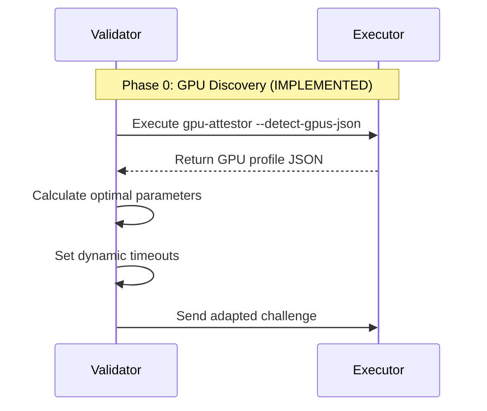

# Basilca to Prime Intellect Migration Guide

## Executive Summary

This document outlines the migration strategy for porting Basilca's GPU attestation system to use Prime Intellect's Freivalds' algorithm-based verification approach. The migration will enable asymmetric verification where validators require significantly less computational resources than miners, while maintaining security through mathematical proofs. 

**UPDATE**: The guide now includes Phase 7, which adds dynamic GPU detection and concurrent verification capabilities. This extension enables automatic adaptation to different GPU hardware configurations and parallel verification for improved performance.

## Key Architectural Changes

### 1. Verification Model Transformation

| Aspect | Current (Basilca) | Target (Prime Intellect) |
|--------|-------------------|------------------------|
| Verification Type | Symmetric (validator runs same computation) | Asymmetric (mathematical proof) |
| Validator Cost | O(n³) - Full computation | O(n²) - Freivalds check + spot checks |
| Security Model | Deterministic reproducibility | Probabilistic with cryptographic commitment |
| GPU Requirements | Validator needs matching GPU | Validator can use any GPU or CPU |

### 2. Protocol Flow Changes

**Current Basilca Flow:**
```
1. Validator generates challenge parameters
2. Miner executes full computation
3. Miner returns checksum
4. Validator executes identical computation
5. Validator compares checksums
```

**Target Prime Intellect Flow:**
```
1. Validator generates (n, seed) for matrices A, B
2. Miner computes C = A × B
3. Miner commits to C via Merkle root
4. Validator reveals challenge vector r
5. Miner computes C·r and provides row proofs
6. Validator performs Freivalds check and spot checks
```

## Migration Components

### Phase 1: Core Algorithm Integration

#### 1.1 Matrix Generation Alignment
- **Port Prime's XORShift128+ PRNG** to Rust for deterministic matrix generation
- **Modify** `challenge/matrix_pow.rs` to use row-based generation like Prime
- **Create** new `MatrixGenerator` trait that supports both approaches

```rust
// New trait in gpu-attestor/src/challenge/mod.rs
pub trait MatrixGenerator {
    fn generate_from_seed(&self, n: usize, seed: &[u8]) -> Result<Matrix>;
    fn generate_row(&self, n: usize, row_idx: usize, seed: &[u8]) -> Result<Vec<f32>>;
}
```

#### 1.2 Merkle Tree Implementation
- **Add** Merkle tree functionality to `gpu-attestor`
- **Port** Prime's row-based hashing approach
- **Integrate** with existing challenge result structure

```rust
// New module: gpu-attestor/src/merkle/mod.rs
pub struct MerkleTree {
    leaves: Vec<[u8; 32]>,
    tree: Vec<[u8; 32]>,
    root: [u8; 32],
}

impl MerkleTree {
    pub fn from_matrix_rows(matrix: &Matrix) -> Self { ... }
    pub fn generate_proof(&self, row_idx: usize) -> Vec<[u8; 32]> { ... }
}
```

### Phase 2: Protocol Implementation

#### 2.1 New Challenge Types
Extend the protocol buffer definitions in `protocol/proto/gpu_pow.proto`:

```protobuf
message FreivaldsChallenge {
    uint32 n = 1;
    bytes master_seed = 2;
    string session_id = 3;
}

message CommitmentResponse {
    bytes merkle_root = 1;
    string session_id = 2;
}

message FreivaldsVerification {
    bytes challenge_vector = 1;
    repeated uint32 spot_check_rows = 2;
}

message RowProof {
    uint32 row_idx = 1;
    bytes row_data = 2;
    repeated bytes merkle_path = 3;
}
```

#### 2.2 Modified Challenge Handler
Create new handler in `gpu-attestor/src/challenge/freivalds_handler.rs`:

```rust
pub struct FreivaldsHandler {
    gpu_devices: Vec<GpuDevice>,
    cuda_contexts: Vec<CudaContext>,
}

impl FreivaldsHandler {
    pub async fn execute_challenge(&mut self, challenge: &FreivaldsChallenge) 
        -> Result<CommitmentResponse> {
        // Generate matrices A, B from seed
        // Compute C = A × B using existing CUDA kernels
        // Build Merkle tree from C
        // Return commitment
    }
    
    pub async fn compute_response(&self, verification: &FreivaldsVerification) 
        -> Result<Vec<RowProof>> {
        // Compute C·r
        // Generate proofs for requested rows
    }
}
```

### Phase 3: Validator Integration

#### 3.1 New Validator Implementation
Create `validator/src/validation/freivalds_validator.rs`:

```rust
pub struct FreivaldsValidator {
    active_sessions: HashMap<String, ValidationSession>,
}

struct ValidationSession {
    n: usize,
    master_seed: Vec<u8>,
    a_matrix: Option<Matrix>,
    b_matrix: Option<Matrix>,
    commitment_root: Option<[u8; 32]>,
    challenge_vector: Option<Vec<f32>>,
}

impl FreivaldsValidator {
    pub fn initiate_challenge(&mut self, gpu_info: &[GpuInfo]) 
        -> Result<FreivaldsChallenge> { ... }
    
    pub fn process_commitment(&mut self, session_id: &str, commitment: CommitmentResponse) 
        -> Result<FreivaldsVerification> { ... }
    
    pub fn verify_response(&mut self, session_id: &str, proofs: Vec<RowProof>) 
        -> Result<bool> { ... }
}
```

#### 3.2 Challenge Generator Updates
Modify `validator/src/validation/challenge_generator.rs`:

```rust
impl ChallengeGenerator {
    pub fn generate_freivalds_challenge(&self, gpu_specs: &[GpuSpecs]) 
        -> Result<FreivaldsChallenge> {
        // Calculate appropriate matrix size based on GPU memory
        // Generate secure random seed
        // Create session ID
    }
}
```

### Phase 4: Communication Protocol Updates

#### 4.1 Multi-Round Communication
Update the miner-validator communication to support multiple rounds:

1. **Challenge Initiation**: Validator → Miner (n, seed)
2. **Commitment**: Miner → Validator (merkle_root)
3. **Verification Request**: Validator → Miner (challenge_vector, spot_rows)
4. **Proof Response**: Miner → Validator (row_proofs)

#### 4.2 Session Management
Add session tracking to handle the multi-round protocol:

```rust
// In miner/src/validator_comms.rs
pub struct ValidationSessionManager {
    active_sessions: HashMap<String, MinerSession>,
}

struct MinerSession {
    challenge: FreivaldsChallenge,
    computed_matrix: Option<Matrix>,
    merkle_tree: Option<MerkleTree>,
    start_time: Instant,
}
```

### Phase 5: Optimization and Performance

#### 5.1 PyTorch Integration (Optional)
For better compatibility with Prime's approach:
- Add PyTorch bindings for matrix operations
- Create hybrid CUDA/PyTorch execution path
- Benchmark performance differences

#### 5.2 Memory Management
Optimize for the new approach:
- Implement streaming matrix generation to reduce memory footprint
- Add row-wise computation options for large matrices
- Cache frequently accessed rows during verification

### Phase 6: Testing and Validation

#### 6.1 Unit Tests
Create comprehensive tests for each component:
- Matrix generation compatibility tests
- Merkle tree construction and verification
- Freivalds algorithm correctness
- Row proof generation and validation

#### 6.2 Integration Tests
Test the full protocol flow:
```rust
// integration-tests/tests/freivalds_e2e.rs
#[tokio::test]
async fn test_freivalds_full_protocol() {
    // Setup validator and miner
    // Execute full protocol flow
    // Verify correct validation
}
```

#### 6.3 Compatibility Tests
Ensure interoperability:
- Test against Prime Intellect's Python implementation
- Verify matrix generation produces identical results
- Confirm Merkle proofs are compatible

## Implementation Timeline

### Week 1-2: Core Algorithm
- Port matrix generation
- Implement Merkle tree
- Create Freivalds verification

### Week 3-4: Protocol Integration
- Update protocol buffers
- Implement new handlers
- Add session management

### Week 5-6: Validator Updates
- Create FreivaldsValidator
- Update challenge generation
- Integrate with existing system

### Week 7-8: Testing and Optimization
- Comprehensive testing
- Performance optimization
- Documentation updates

### Week 9-10: GPU Profile Infrastructure (Phase 7.1)
- Create GPU profiler module
- Build GPU performance database
- Implement profile detection
- Add SSH-based profile query

### Week 11-12: Dynamic Configuration (Phase 7.2)
- Implement adaptive timeout calculation
- Add matrix size optimization
- Create performance prediction models
- Update validator configuration

### Week 13-14: Concurrent Verification (Phase 7.3)
- Implement parallel verification
- Add thread pool management
- Create result aggregation
- Benchmark and optimize

## Migration Risks and Mitigations

### Risk 1: Performance Regression
**Mitigation**: Maintain both verification methods during transition, benchmark extensively

### Risk 2: Security Model Change
**Mitigation**: Conduct security audit, implement configurable security parameters

### Risk 3: Compatibility Issues
**Mitigation**: Create compatibility layer, extensive cross-implementation testing

## Configuration and Feature Flags

Add configuration options to control the migration:

```toml
# validator/config.toml
[validation]
mode = "hybrid"  # "basilca", "freivalds", or "hybrid"

[validation.freivalds]
enable = true
spot_check_count = 10
verification_sample_rate = 0.1
matrix_precision = "f32"

[validation.fallback]
enable = true
fallback_to_basilca = true
```

## Monitoring and Metrics

Add new metrics for the Freivalds approach:
- Commitment generation time
- Freivalds verification time
- Spot check success rate
- Memory usage comparison
- Network overhead for multi-round protocol

## Rollback Strategy

If issues arise:
1. Feature flag to disable Freivalds validation
2. Revert to symmetric verification
3. Maintain backward compatibility for at least 2 versions

## Benefits After Migration

1. **Reduced Validator Costs**: O(n²) instead of O(n³) computation
2. **Broader Validator Pool**: No need for matching GPU hardware
3. **Better Scalability**: Validators can verify larger computations
4. **Maintained Security**: Mathematical proof provides strong guarantees
5. **Future Flexibility**: Easier to adapt to new GPU architectures

## Phase 7: Dynamic GPU Detection and Concurrent Verification 🔍 ✅

### 7.1 Automatic GPU Profiling (COMPLETED)

Enhance the Freivalds protocol with dynamic GPU detection and performance-aware configuration:

#### 7.1.1 GPU Profile Discovery
**Status**: ✅ IMPLEMENTED in `crates/gpu-attestor/src/gpu/gpu_profiler.rs`

```rust
// Structure implemented for GPU profiling
#[derive(Debug, Clone, Serialize, Deserialize)]
pub struct GpuProfile {
    pub devices: Vec<GpuDeviceProfile>,
    pub total_compute_power: f64, // TFLOPS
    pub total_memory_bandwidth: f64, // GB/s
    pub optimal_matrix_size: u32,
    pub performance_class: PerformanceClass,
    pub topology: SystemTopology,
}

#[derive(Debug, Clone, Serialize, Deserialize, PartialEq, Eq, PartialOrd, Ord)]
pub enum PerformanceClass {
    DataCenter,    // H100, A100, V100
    Professional,  // RTX 4090, RTX 3090
    Consumer,      // RTX 3080, RTX 3070
    Entry,         // GTX series
}
```

**Implementation Details**:
- Successfully tested with 8 H100 PCIe GPUs
- JSON output via `gpu-attestor --detect-gpus-json`
- Automatic optimal matrix size calculation based on available memory
- GPU performance database with real benchmark data included

#### 7.1.2 Protocol Flow Enhancement


**Example Output** (from actual H100 system):
```json
{
  "total_compute_power": 350.2,
  "total_memory_bandwidth": 24000.0,
  "optimal_matrix_size": 4096,
  "performance_class": "DataCenter",
  "devices": [/* 8 H100 PCIe GPUs */]
}
```

### 7.2 GPU-Aware Timeout Calculation

Replace static timeout calculations with dynamic GPU-aware computation:

```rust
pub fn calculate_gpu_aware_timeouts(
    matrix_size: u32,
    gpu_profile: &GpuProfile,
) -> (u32, u32) {
    // Get GPU-specific performance data
    let perf_gflops = match_gpu_performance(&gpu_profile.devices[0].model);
    
    // Calculate time based on actual GPU capabilities
    let operations = 2.0 * (matrix_size as f64).powi(3);
    let base_time_ms = (operations / (perf_gflops * 1e9) * 1000.0) as u32;
    
    // Adjust for multi-GPU with parallel efficiency
    let gpu_count = gpu_profile.devices.len() as f32;
    let parallel_efficiency = 0.8;
    let adjusted_time_ms = (base_time_ms as f32 / (gpu_count * parallel_efficiency)) as u32;
    
    (computation_timeout, protocol_timeout)
}
```

### 7.3 Concurrent Verification Implementation

Enable parallel verification for multi-core validator systems:

#### 7.3.1 Concurrent Spot Check Verification
```rust
pub async fn verify_response_concurrent(
    &self,
    response: FreivaldsResponse,
    gpu_profile: &GpuProfile,
) -> Result<FreivaldsVerificationResult> {
    // Partition spot checks across threads
    let num_threads = self.config.max_verification_threads;
    let chunks = partition_spot_checks(&response.row_proofs, num_threads);
    
    // Spawn concurrent verification tasks
    let mut tasks = JoinSet::new();
    for chunk in chunks {
        tasks.spawn(async move {
            verify_spot_check_batch(chunk)
        });
    }
    
    // Aggregate results
    join_all(tasks).await
}
```

#### 7.3.2 Performance Benefits
- **Single-threaded**: O(s) for s spot checks
- **Multi-threaded**: O(s/t) for t threads
- **Typical speedup**: 4-8x on modern CPUs

### 7.4 Implementation Phases

#### Phase 7.1: GPU Profile Infrastructure (Week 9-10)
- Create `gpu_profiler.rs` module
- Add GPU performance database
- Implement profile detection CLI mode
- Add SSH-based profile query

#### Phase 7.2: Dynamic Configuration (Week 11-12)
- Update `FreivaldsValidatorConfig` with GPU profiles
- Implement adaptive timeout calculation
- Add matrix size optimization logic
- Create performance prediction models

#### Phase 7.3: Concurrent Verification (Week 13-14)
- Implement parallel spot check verification
- Add thread pool management
- Create result aggregation logic
- Benchmark concurrent vs sequential

### 7.5 Configuration Extensions

```toml
# validator/config.toml
[validation.freivalds.gpu_detection]
enabled = true
profile_cache_duration = 3600  # seconds
fallback_profile = "rtx_3090"

[validation.freivalds.concurrency]
max_verification_threads = 8
enable_parallel_checks = true
batch_size = 16

[validation.freivalds.gpu_profiles]
[validation.freivalds.gpu_profiles.h100]
model_pattern = "H100"
overhead_factor = 1.5
matrix_multiply_gflops = { 256 = 15000, 512 = 20000, 1024 = 25000, 2048 = 30000 }

[validation.freivalds.gpu_profiles.a100]
model_pattern = "A100"
overhead_factor = 1.8
matrix_multiply_gflops = { 256 = 8000, 512 = 12000, 1024 = 15000, 2048 = 18000 }
```

### 7.6 Testing Extensions

#### Unit Tests
- GPU profile detection accuracy
- Timeout calculation for various GPU models
- Concurrent verification correctness
- Performance prediction validation

#### Integration Tests
- Full adaptive protocol flow
- Multi-GPU detection and configuration
- Heterogeneous GPU handling
- Network latency adaptation

### 7.7 Monitoring Additions

New metrics for GPU-aware execution:
- `freivalds_gpu_profile_detection_time`
- `freivalds_adaptive_timeout_accuracy`
- `freivalds_concurrent_verification_speedup`
- `freivalds_gpu_utilization_efficiency`

## Benefits of Extended Implementation

1. **Automatic Optimization**: No manual configuration needed for different GPU types
2. **Heterogeneous Support**: Works with mixed GPU farms
3. **Future-Proof**: New GPU models automatically supported via profile database
4. **Efficient Resource Usage**: Concurrent verification maximizes CPU utilization
5. **Reduced Latency**: Parallel verification reduces total validation time
6. **Better Scalability**: Adapts to both high-end and entry-level GPUs

## Conclusion

This migration will transform Basilca's GPU attestation from a symmetric, hardware-dependent system to an asymmetric, mathematically-proven verification system with intelligent GPU detection and concurrent execution. The phased approach ensures minimal disruption while providing clear benefits in terms of scalability, cost-effectiveness, and adaptability for validators across diverse hardware configurations.